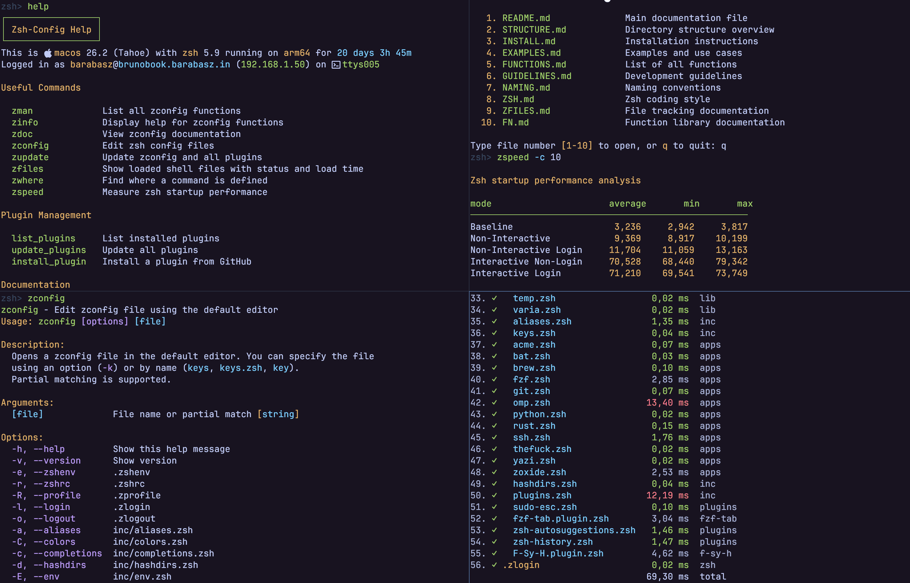

# zconfig

**zconfig** is a modern, modular, and performance-optimized Zsh framework architected for maintainability and near-instant startup. It eschews the overhead of bloated frameworks in favor of a lightweight, custom-tailored architecture that prioritizes speed without sacrificing power.

Whether you are a Zsh power user or just taking your first steps in the terminal, zconfig is built for you. It provides beginners with a stable, "batteries-included" environment out of the box, while offering veterans the modular flexibility needed to deeply customize and refine their workflow.

👉 For installation instructions, see [INSTALL.md](docs/INSTALL.md).



## Key Technical Pillars

- **Modular Architecture:** The configuration is organized into specialized files and directories with a strict separation of concerns, making it easy to navigate, debug, and extend.
- **Robust Function Framework**: Includes `fn.zsh`, a dedicated library for building professional Zsh functions. It provides standardized metadata handling, automated help generation, robust option parsing, and strict argument validation/type checking.
- **Automatic Bytecode Compilation:** To ensure maximum responsiveness, `zconfig` automatically handles `zcompile` for all configuration scripts, leveraging `.zwc` files for faster execution.
- **Modern Prompt Engine:** Leverages [oh-my-posh](https://ohmyposh.dev/) as its primary prompt engine for a highly customizable, themeable, and cross-shell experience.
- **Advanced Syntax Highlighting:** Integrates [F-Sy-H](https://github.com/z-shell/F-Sy-H) (Fast-Syntax-Highlighting), providing a more feature-rich and performant alternative to standard highlighting plugins.
- **Lightweight Plugin System:** Built with zero Oh-My-Zsh dependencies, it features a streamlined management system to add and update plugins without sacrificing performance.
- **Intelligent Completions:** Combines [zsh-autosuggestions](https://github.com/zsh-users/zsh-autosuggestions) for fluid, fish-like command suggestions with [fzf-tab](https://github.com/Aloxaf/fzf-tab) to replace the standard completion menu with a high-performance fuzzy-search interface.
- **File Tracking System:** Includes the `zfiles` command to track all sourced files with their respective load times and status, making it easy to identify bottlenecks and optimize startup performance.

## Documentation

| File | Description |
|------|-------------|
| [EXAMPLES.md](docs/EXAMPLES.md) | Examples and use cases |
| [FN.md](docs/FN.md) | Function library for building standardized functions |
| [FUNCTIONS.md](docs/FUNCTIONS.md) | List of all available functions |
| [GUIDELINES.md](docs/GUIDELINES.md) | Development guidelines |
| [INSTALL.md](docs/INSTALL.md) | Installation instructions |
| [NAMING.md](docs/NAMING.md) | Naming conventions |
| [STRUCTURE.md](docs/STRUCTURE.md) | Directory structure |
| [ZFILES.md](docs/ZFILES.md) | File tracking system |
| [ZSH.md](docs/ZSH.md) | Zsh coding style |

## Philosophy

1. **Performance First** - Track loading times, lazy load heavy apps, minimize startup
2. **Modularity** - Each component in separate file with single responsibility
3. **Zsh-Native** - No bash compatibility, use zsh-specific features exclusively
4. **Explicit Over Implicit** - Clear naming conventions, documented behavior

## Directory Overview

```
~/.config/zsh/
├── .zshenv           # Entry point (always sourced first)
├── .zshrc            # Interactive shell setup
├── .zprofile         # Login shell initialization
├── .zlogin           # Post-login actions
├── .zlogout          # Logout cleanup
├── inc/              # Core configuration modules
├── lib/              # Helper function library
├── apps/             # Application integrations
├── functions/        # Autoloaded user functions
├── plugins/          # Zsh plugins (wrappers + git clones)
└── cache/            # Runtime cache
```

See [STRUCTURE.md](docs/STRUCTURE.md) for detailed structure.

## Core Components

### Entry Points

| File | Purpose |
|------|---------|
| `.zshenv` | Always sourced first; loads tracking, core config, PATH, locale |
| `.zshrc` | Interactive shell; loads lib/, options, colors, aliases, apps, plugins |
| `.zprofile` | Login shell initialization |
| `.zlogin` | Post-login actions (cleanup, display system info) |

### Configuration Modules (`inc/`)

Core configuration split by responsibility. Each file handles one concern.

| File | Purpose |
|------|---------|
| `env.zsh` | Core environment variables |
| `zfiles.zsh` | File tracking infrastructure |
| `modules.zsh` | Zsh module loading (`zmodload`) |
| `xdg.zsh` | XDG Base Directory variables |
| `colors.zsh` | ANSI color code variables |
| `icons.zsh` | Icon/glyph variables |
| `options.zsh` | Shell options (setopt/unsetopt) |
| `prompt.zsh` | Fallback prompt |
| `path.zsh` | PATH configuration |
| `hashdirs.zsh` | Named directory hashes (`~zsh`, `~gh`, etc.) |
| `aliases.zsh` | Command aliases |
| `keys.zsh` | Key bindings |
| `completion.zsh` | Completion configuration |
| `locales.zsh` | Locale settings |
| `plugins.zsh` | Plugin loading configuration |

### Helper Library (`lib/`)

Fast utility functions loaded in `.zshrc` (interactive sessions only). See individual files for available functions. Use `zman` to list all functions or `zinfo <function>` for details.

| File | Category |
|------|----------|
| `archive.zsh` | Archive extraction and compression (`extract`, `compress`) |
| `arrays.zsh` | Array utilities (`array_contains`, `array_map`, etc.) |
| `clipboard.zsh` | Clipboard operations (`clip_copy`, `clip_paste`, etc.) |
| `compile.zsh` | Bytecode compilation (`compile_zsh_config`, `compile_dir`, etc.) |
| `cwg.zsh` | Complementary-multiply-with-carry random number generator |
| `date.zsh` | Date/time functions (`now_iso`, `format_duration`, etc.) |
| `files.zsh` | File system tests (`is_file`, `is_dir`, `is_link`, etc.) |
| `hardware.zsh` | Hardware info (`get_cpu_count`, `get_ram_total`, etc.) |
| `math.zsh` | Math utilities (`abs`, `round`, `random`, `format_bytes`, etc.) |
| `network.zsh` | Network utilities (`get_local_ip`, `is_online`, etc.) |
| `path.zsh` | PATH manipulation (`path_append`, `path_prepend`, etc.) |
| `plugins.zsh` | Plugin management (`install_plugin`, `load_plugin`, etc.) |
| `print.zsh` | Print functions for formatted output (`printe`, `printkv`, etc.) |
| `shell.zsh` | Shell info (`shell_ver`, `is_interactive`, etc.) |
| `strings.zsh` | String manipulation (`trim`, `lowercase`, `str_contains`, etc.) |
| `system.zsh` | OS detection (`is_macos`, `is_linux`, `os_name`, etc.) |
| `varia.zsh` | Miscellaneous (`is_debug`, `etime`, `is_installed`, `confirm`) |

### Application Integrations (`apps/`)

External tool configurations. Loaded dynamically in `.zshrc`. Each file follows the pattern:

```zsh
#!/bin/zsh
zfile_track_start ${0:A}

if is_installed <tool>; then
    # Configuration here
fi

zfile_track_end ${0:A}
```

Use `_` prefix for priority loading (e.g., `_brew.zsh` loads before `fzf.zsh`).

### Plugins (`plugins/`)

Lightweight plugin system without Oh-My-Zsh. Each plugin has:
- `<name>.zsh` - Wrapper file (versioned, your configuration)
- `<name>/` - Git clone (in `.gitignore`, auto-compiled)

```zsh
# Install a plugin
install_plugin <name> <github-user/repo>

# Update all plugins
update_plugins

# List plugins
list_plugins
```

See `lib/plugins.zsh` for all available functions.

### User Functions (`functions/`)

Autoloaded functions available on-demand. No function declaration needed in files - just write the function body directly.

| Function | Description |
|----------|-------------|
| `zhelp` | Display helpful commands and documentation |
| `zdoc` | Browse and view documentation files |
| `zman` | List all zconfig functions with filtering |
| `zinfo` | Display version, path, and description of any command |
| `zconfig` | Edit zsh config files using the default editor |
| `zfiles` | Show loaded shell files with status and load time |
| `zupdate` | Update zconfig and all plugins |
| `zgit` | Git wrapper for bulk operations on repositories |
| `sysinfo` | Display system information summary |
| `logininfo` | Display login information |
| `cpuinfo` | Display CPU hardware and load statistics |
| `meminfo` | Display memory usage statistics |
| `diskinfo` | Display disk usage statistics |
| `lanip` | Retrieve local IP address |
| `wanip` | Retrieve public IP address |
| `mdig` | Multi-DNS query tool |
| `sslinfo` | Inspect SSL certificates |
| `urlinfo` | URL information tool |
| `ttfb` | Measure Time To First Byte |
| `execs` | Execute command with animated spinner |
| `collatz` | Calculate Collatz sequences |
| `primes` | Prime number generator and tester |
| `getrandom` | Generate random numbers with formatting |
| `j2y` | Convert JSON to YAML |
| `y2j` | Convert YAML to JSON |

## Configuration Variables

All configuration variables are defined in `inc/env.zsh` with sensible defaults. Override them by setting before shell startup (e.g., `ZSH_DEBUG=0 zsh`).

| Variable | Default | Description |
|----------|---------|-------------|
| `ZSH_DEBUG` | 1 | Enable debug messages |
| `ZSH_ZFILE_DEBUG` | 0 | Enable file tracking debug messages |
| `ZSH_LOGIN_INFO` | 0 | Show login info on startup |
| `ZSH_SYS_INFO` | 0 | Show system info on startup |
| `ZSH_AUTOCOMPILE` | 1 | Auto-compile `.zsh` to `.zwc` bytecode |
| `ZSH_LOAD_LIB` | 1 | Load library files from `lib/` |
| `ZSH_LOAD_USER_FUNCS` | 1 | Load functions from `functions/` |
| `ZSH_LOAD_SHELL_FUNCS` | 1 | Autoload shell functions (zargs, zmv, etc.) |
| `ZSH_LOAD_APPS` | 1 | Load app configurations from `apps/` |
| `ZSH_LOAD_PLUGINS` | 1 | Load plugins from `plugins/` |
| `ZSH_PLUGINS_AUTOINSTALL` | 1 | Auto-install missing plugins |
| `ZSH_LOAD_KEYS` | 1 | Load key bindings from `keys.zsh` |
| `ZSH_LOAD_ALIASES` | 1 | Load aliases from `aliases.zsh` |
| `ZSH_LOAD_COLORS` | 1 | Load colors from `colors.zsh` |
| `ZSH_LOAD_COMPLETION` | 1 | Load completion config from `completion.zsh` |
| `ZSH_LOAD_HASHDIRS` | 1 | Load directory hashes from `hashdirs.zsh` |
| `ZSH_LOAD_OPTIONS` | 1 | Load shell options from `options.zsh` |

**Examples:**
```zsh
# Minimal shell (no apps, no plugins)
ZSH_LOAD_APPS=0 ZSH_LOAD_PLUGINS=0 zsh

# Debug a plugin issue
ZSH_LOAD_PLUGINS=0 zsh

# Quiet mode (no debug output)
ZSH_DEBUG=0 zsh
```

## Bytecode Compilation

Zsh files are automatically compiled to `.zwc` bytecode for faster loading (~10% speedup).

**How it works:**
- On shell startup, `compile_zsh_config -q` checks all files in `lib/`, `inc/`, `apps/`
- Only changed files are recompiled (compares timestamps)
- Overhead: ~0.3ms (negligible)
- Zsh automatically uses `.zwc` when newer than `.zsh`
- Controlled by `ZSH_AUTOCOMPILE` variable

**After editing a file:**
1. First shell startup → uses `.zsh` (newer), then recompiles
2. Next shell startup → uses `.zwc` (faster)

**Manual commands:**
```zsh
compile_zsh_config      # Compile with output
compile_zsh_config -q   # Compile quietly
clean_zsh_config        # Remove all .zwc files
```

See `lib/compile.zsh` for all compilation functions.

## Best Practices

See [GUIDELINES.md](docs/GUIDELINES.md) for do's, don'ts, file type rules, common patterns, and performance tips.

## Troubleshooting

### Shell Starts Slowly

1. Run `zspeed` to benchmark startup time across shell modes
2. Run `zfiles` to identify slow files (> 10ms is suspicious)
3. Use `zinfo -i <command>` to inspect specific tools and their load cost
4. Consider lazy loading heavy apps (see [GUIDELINES.md](docs/GUIDELINES.md#lazy-loading))
5. Check for unnecessary external commands — prefer zsh builtins

### Function Not Found

1. Run `zman` to list all available functions
2. Run `zinfo <name>` to check if the command exists and where it's defined
3. For `functions/`: verify the file exists and has correct permissions
4. Reload the shell: `reload` or `exec zsh`

### Changes Not Applied

1. Run `reload` to restart the shell with the new configuration
2. Or manually: `source ~/.zshenv` (for `lib/`, `inc/`) or `source ~/.zshrc` (for `apps/`)
3. After editing `functions/`: `unfunction <name>` then call it again (autoload will reload)

### Check Installation

Run `zcheck` to verify zconfig installation, directory structure, and loaded components.

## References

### zconfig Tools

| Command | Description |
|---------|-------------|
| `zhelp` | Display helpful commands and documentation |
| `zdoc` | Browse and view documentation files |
| `zman` | List all functions from `lib/` and `functions/` |
| `zinfo` | Display version, path, and description of any command |
| `zfiles` | Show loaded shell files with status and load time |
| `zspeed` | Measure zsh startup performance |
| `zcheck` | Check zconfig installation and configuration |
| `zconfig` | Edit zconfig files using the default editor |
| `zupdate` | Update zconfig, plugins, and system packages |

### Zsh Documentation

- `man zshall` — complete zsh manual
- `man zshexpn` — parameter expansion
- `man zshbuiltins` — builtin commands
- `man zshcompsys` — completion system
